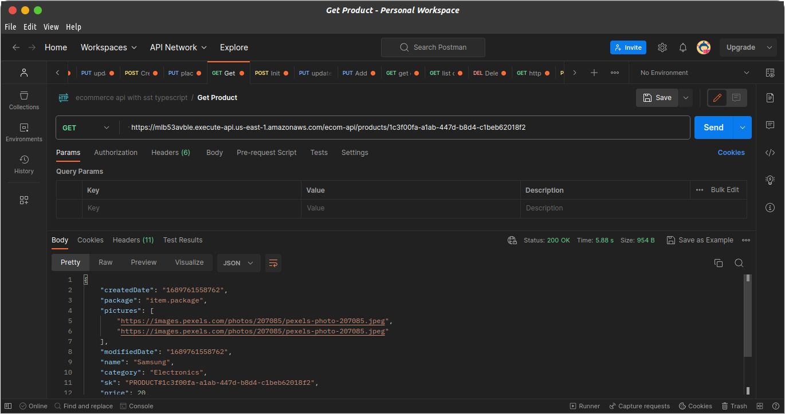

## Testing the get Product by ID Endpoint
Let's get a product by providing its id.

Still in postman, change the path to `/products/1c3f00fa-a1ab-447d-b8d4-c1beb62018f2`

`1c3f00fa-a1ab-447d-b8d4-c1beb62018f2` is the id of the product. I got that from the dynamodb table.

Request method is `GET`

There isn't any request body
1. **Postman**

2. **SST Console**

