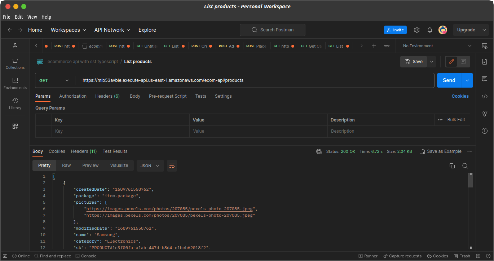

## Testing the List Products Endpoint
Now, lets retrieve all products from the dynamodb table

Still in postman, change the path to /products

Request is `GET`

There isn't any request body

# Postman

# The SST Console

